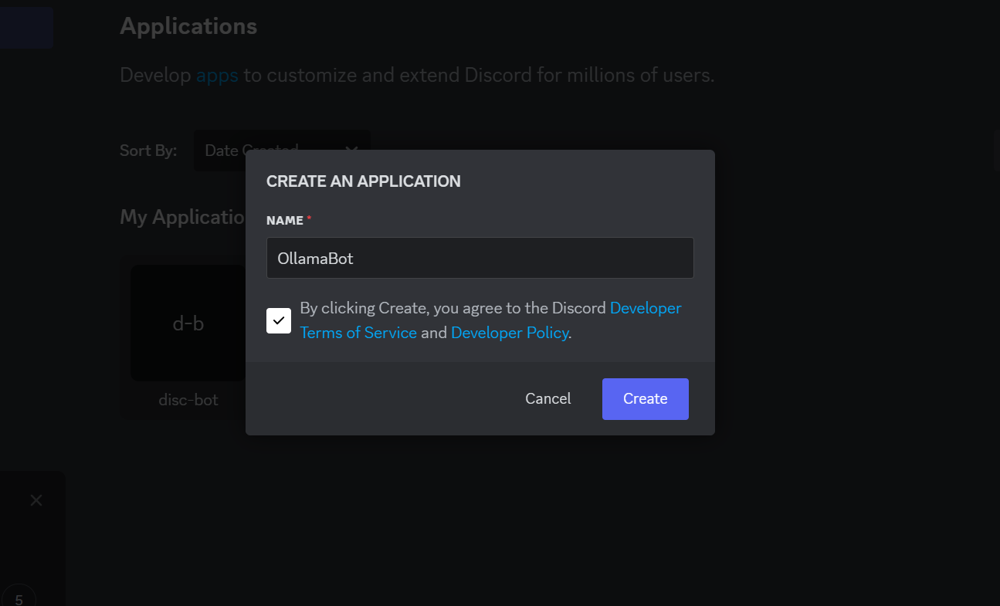

# Discord Bot with Ollama API

This project is a Discord bot that integrates with an Express server to generate AI-powered responses using Ollama. Users can send messages with a prefix (`!`) in a Discord server, and the bot will generate a response using the DeepSeek model.

## Features
- AI-generated responses using Ollama API
- Express backend for handling AI requests
- Discord bot using `discord.js`
- Configurable command prefix

## Prerequisites
Ensure you have the following installed:
- [Node.js](https://nodejs.org/)
- [Discord Developer Account](https://discord.com/developers/applications)
- [Ollama](https://ollama.com/)
 installed in your system.

## Set-up
The installation can be divided into two steps, since the project is currently not deployed, users will have to run to run their own backend to run this chatbot. 

### First Step (Setting up a bot on discord):

---

## **1. Create a New Bot**
1. Go to the [Discord Developer Portal](https://discord.com/developers/applications).
2. Click **New Application** → Enter a name → Click **Create**.
   

---

## **2. Configure Bot Settings**
### **Enable Privileged Intents**
1. Scroll down to **Privileged Gateway Intents**.
2. Enable **MESSAGE CONTENT INTENT**.
3. Click **Save Changes**.

   

---
## **3. Copy the Bot Token**
1. Under **Bot**, scroll down to the **Token** section.
2. Click **Reset Token** if needed.
3. Copy and store it in the `.env` file (explained later).

   


---

## **4. Add the Bot to a Discord Server**
1. Navigate to **OAuth2** → **URL Generator**.
2. Select **bot** and **applications.commands**.


3. Under **Bot Permissions**, select:
   - **Send Messages**
   - **Read Message History**
   - **Connect**
   - **Use Slash Commands** (optional)

4. Copy the generated URL and open it in your server.
5. Select your server and **authorize the bot**.


---
### Second Step (Running the backend of the bot so that it gives responses on the channel):

### **Start Ollama**
Before running the bot, make sure Ollama is installed and running (if you do not have Ollama installed in your system, check out the Prerequisites section):

```sh
ollama serve
```


### 1. Clone the repository
```sh
git clone https://github.com/yourusername/discord-ollama-bot.git
cd discord-ollama-bot
```

### 2. Install dependencies
```sh
npm install
```

### 3. Set up environment variables
Create a `.env` file in the root directory and add the following:
```plaintext
DISCORD_TOKEN=your_discord_bot_token
PREFIX=! (this prefix can be the user's choice)
```
Replace `your_discord_bot_token` with your actual bot token from the [Discord Developer Portal](https://discord.com/developers/applications).

### 4. Start the Express server
Run the following command to start the backend:
```sh
node index.js
```

### 5. Start the Discord bot
Run:
```sh
npm run bot
```

## Usage
- Type `!your-message` in a Discord server where the bot is added.
- The bot will send an AI-generated response based on the message.

## Future Updates
Adding vector db to increase llm memory
```
[Bot] <-> [Express App] <-> [Vector Search] <-> [Qdrant]
                                   |
                                [Ollama]
```

## Deployment
- Deploy the Express backend to services like **Vercel**, **Railway**, or a **VPS**.
- Host the Discord bot on **Replit**, **Railway**, or a **VPS** for 24/7 uptime.

## Future Improvements
- Add **slash commands** support.
- Improve response handling and error messages.
- Deploy backend to a cloud-based solution.

## License
This project is open-source under the [MIT License](LICENSE).

---

### Need Help?
Feel free to open an issue or reach out!

